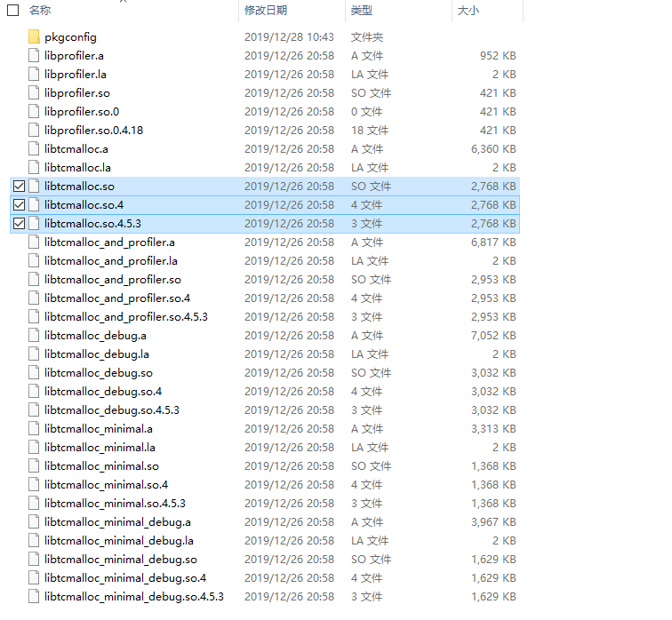
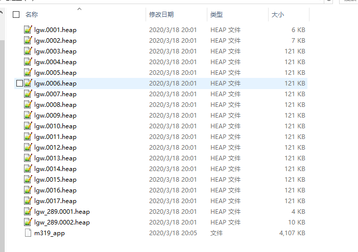
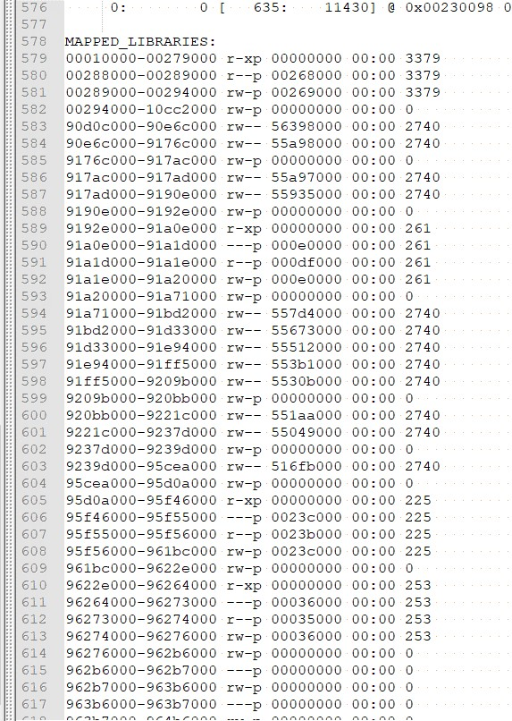
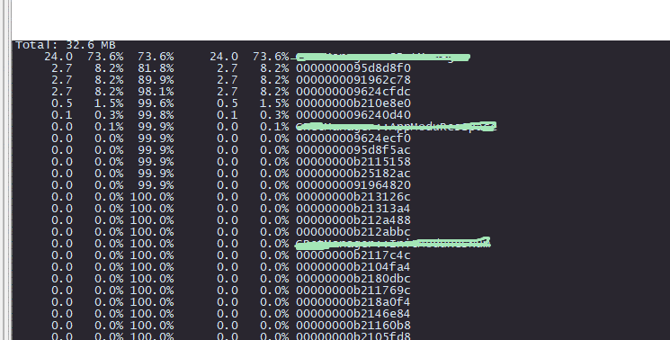
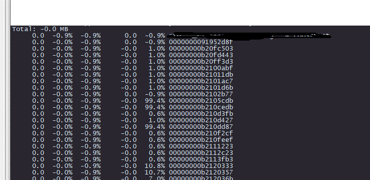

# Linux内存泄漏

## 为什么是你

内存泄漏是一个常见的问题，但如何快速解决并定位泄漏点？

https://elinux.org/Memory_Debuggers#mpatrol

官方给出了几个内存调试工具

- mtrace
- memwatch
- mpatrol
- dmalloc
- dbgmem
- valgrind
- Electric Fence

包括gcc自带的asan内存检查工具等，在用过以上其中几个工具后有几点体会

- 有些工具需要修改程序代码才能进行使用，一般程序固件进入系统测试环节后无法进行修改再编译
- 有些工具对程序的时序包括性能有影响，由于和生产环境的时序不同一些问题难以暴露，有些工具性能太差以至于在嵌入式设备上都无法愉快的运行。
- 基本上所有工具的排查内存泄漏的原理都是将当前所有有效内存都dump出来然后再进行比较，定位内存泄漏的位置需要不同时刻的内存情况进行比较，这时候就需要友好的比较工具

基于以上三点，tcmalloc脱颖而出

- 无需修改代码即可食用
- 性能强于glibc的内存管理，程序的问题更容易暴露
- 友好的比较工具，快速定位内存泄漏点

tcmalloc你值得拥有。

## tcmalloc如何食用

https://github.com/gperftools/gperftools

交叉编译略过

编译完成后虽然有很多，只需将libtcmalloc.so拷贝至设备的/lib或/lib64下



```
env LD_PRELOAD="/lib/libtcmalloc.so" HEAPPROFILE=/home/lgw HEAP_PROFILE_TIME_INTERVAL=10 ./m319_app
```

用以上命令启动执行可执行程序

HEAPPROFILE用于指定存放内存dump文件路径可以直接生成在nfs路径里lgw代表生成的heap文件前缀

HEAP_PROFILE_TIME_INTERVAL设置内存dump间隔时间，上述是10s 

在程序运行过程中会在指定的路径下每隔指定时间生成内存的dump文件以heap命名结尾



然后把heap文件和对应的可执行程序拷贝出来在服务器上分析

打开heap文件最下方有可执行程序的map信息



在服务器上分析heap文件

单一heap文件分析命令

pprof --text m319_app lgw.0007.heap



Total总内存32.6MB 内存占比从高到低 最后一列是地址，动态库里的地址符号显示不出来可以对应之前的map信息查看进行分析然后objdump对应动态库，显示的是当前时刻程序的内存分布及占比。

两个heap文件分析命令

pprof --text m319_app --base=lgw.0007.heap lgw.0008.heap


会显示从lgw.0007.heap对应的时刻到lgw.0008.heap对应的时刻的内存变化，内存泄漏分析一般分析比较初始的heap文件和最后时刻的heap文件可以明显看出内存增量是谁产生的。

精准定位，有效打击。