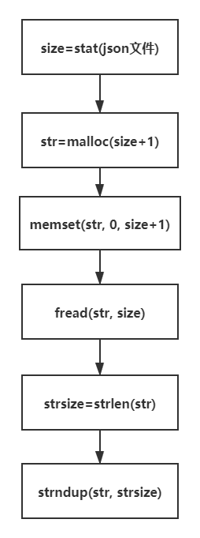

# asan排查内存问题

现象：程序里重复运行一个组件的初始化与反初始化，每次初始化与反初始化之后没有内存泄漏，长时间烤机也是ok的，但是每次初始化之后的内存增量都会有变化，就是说重复运行初始化之后内存增量都不同，但反初始化之后都能释放。如图


明显是初始化有问题，如何去查？上asan。

https://github.com/google/sanitizers/wiki/AddressSanitizer

给读者一个建议，如何使用一个工具不要百度，不要看csdn，很浪费时间的。

官方这么明显的how to use the tool


点击这个AddressSanitizer，跟着官方来使用asan。

## 获取asan


如果你的gcc版本高于4.8，asan是自带的，如果不是点击AddressSanitizerHowToBuild去编译。对于交叉编译工具，同理，不过需要将交叉编译工具里的libasan动态库拷贝到运行设备上就可以了。

## 使用asan


编译时直接增加编译选项

```
-fsanitize=address -O1 -fno-omit-frame-pointer
```

这里asan建议优化等级O1或者更高。编译时有可能需要链接stdc++

```
 -lstdc++
```

编译完成，运行前需要准备libasan动态库，运行程序如果发现内存问题，asan会打印错误报告并结束程序。有几个典型的错误报告


- 使用非法地址（野指针）
- 堆越界溢出
- 栈越界溢出
- 全局变量越界溢出
- 使用函数内的栈空间
- 作用域外使用变量
- 变量初始化错误
- 内存泄漏

这几个非常典型的内存问题在页面里点击后都会有典型的实例代码以及asan的相应的错误报告。

在使用的过程中，asan发现内存错误并报告后程序就退出了，asan只报告了调用栈，但是无法更加详细的查看到栈内的一些变量的值等更详细的信息。继续浏览网页是有解决办法的。

## asan&gdb


这里我的操作是

```
gdb 可执行程序
b main
r
b __sanitizer::Die
c
```

然后asan报告完毕后就会停下来，然后就可以通过gdb查看详细的程序信息。

这里需要先运行到main再对__sanitizer::Die符号打断点，一开始程序没有加载动态库，是找不到这个符号的。

## 结论

通过以上方法，查看组件的出问题时候的调用栈得到结论，asan报告的是strlen接口读取越界，传入的字符串最后不是'\0'，流程大概如下


读取文件，文件最后不是'\0'导致strsize的大小取决于str（malloc内存）之后的数据情况，strsize每次都会不一样，进而导致最开始出现的情况

修改后的正确流程



asan在strlen的阶段就报告了堆读取越界错误，非常靠谱。
