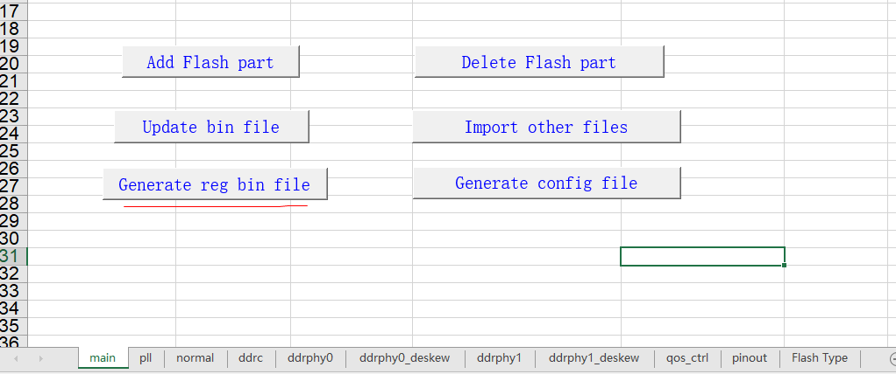
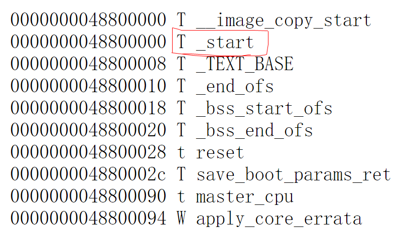
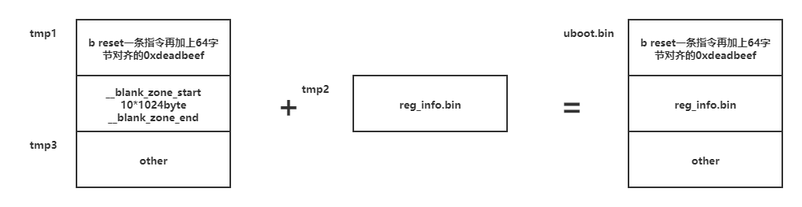
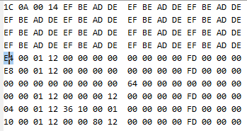
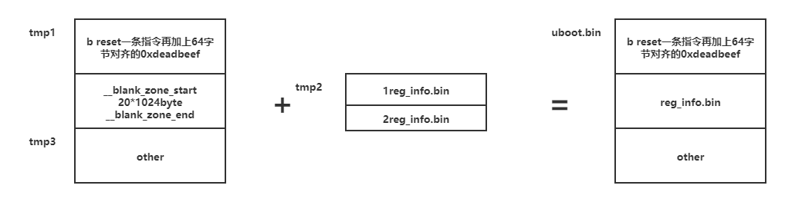
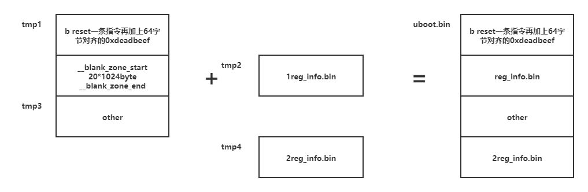
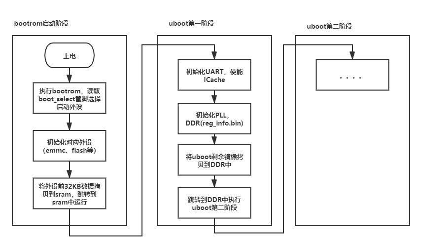
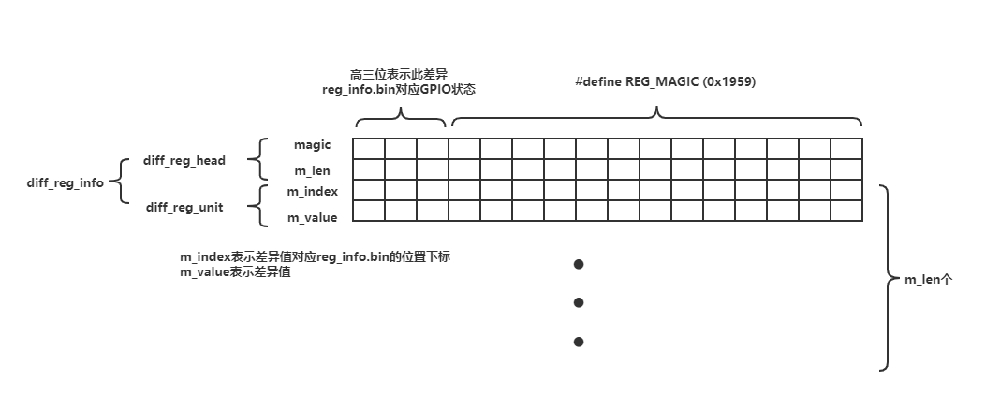
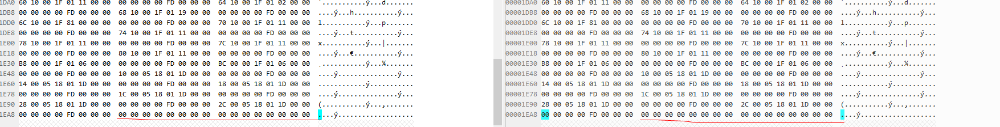
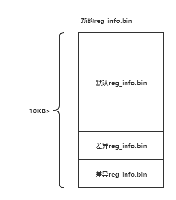

# uboot兼容多配置DDR

## 问题

在产品生产过程中，即使是相同的芯片平台，但是使用了不一样型号的DDR往往需要提供不同的uboot供产线生产，往往在产品的迭代中也会涉及到硬件DDR型号的升级更换，伴随着uboot的更新，如果uboot无法做到兼容之前的硬件版本的DDR就需要软件人员同时维护多个版本的uboot，如果做到uboot兼容多配置DDR只需软件人员维护一个版本uboot即可减少工作量以及提高产线的生产效率。

## 分析及解决流程

以海思平台为例，Hisi的SDK中提供的DDR寄存器配置excel表生成reg_info.bin文件供uboot编译打包，在表格中修改相应寄存器参数然后点击红框按钮生成bin文件，按正常流程一种DDR型号对应一个excel表生成的reg_info.bin文件然后供uboot工程编译出一个uboot.bin文件。如下图

接着分析Makefile中对reg_info.bin的使用，分析reg_info.bin在uboot镜像中的位置。

```
REG := $(TOPDIR)/.reg
SRC := $(notdir $(SSRC))

################################################################################
.PHONY: $(BOOT).bin
$(BOOT).bin: $(BOOT).tmp regfile
	@dd if=./$(BOOT).tmp of=./tmp1 bs=1 count=64 2>/dev/null
	@dd if=$(REG) of=./tmp2 bs=10240 conv=sync 2>/dev/null
	@dd if=./$(BOOT).tmp of=./tmp3 bs=1 skip=10304 2>/dev/null
	@cat tmp1 tmp2 tmp3 > $(BOOT).bin
	@rm -f tmp1 tmp2 tmp3 tmp4
	@cp $(BOOT).bin $(TOPDIR)/../zoos/
	@chmod 754 $(BOOT).bin
	@cp -fv $@ $(TOPDIR)
	@echo $(BOOT).bin is Ready.
```

以上Makfile部分代码就是对reg_info.bin文件的打包操作。其中REG就是reg_info.bin文件。

```
arch\arm\cpu\armv8\hi3559av100\start.S    
  /* read init table and config registers */
    ldr    x0, _blank_zone_start    //将_blank_zone_start标号存放的值赋值给x0    
    ldr    x1, _TEXT_BASE           //将_TEXT_BASE标号存放的值赋值给x1    
    sub    x0, x0, x1               //x0 = x0 - x1
    adr    x1, _start               //将_start标号所在的相对地址赋值给x1
    add    x0, x0, x1               //x0 = x0 + x1

    mov    x1, #0                  /* flags: 0->normal 1->pm */
    bl     init_registers
    bl	   start_ddr_training
```

以上是uboot第一阶段start.S中调用初始化硬件寄存器的部分汇编代码。

```
arch\arm\cpu\armv8\hi3559av100\init_registers.c
/*
 * base - reg base address
 * pm   - is suspend
 *      0 normal
 *      1 pm
 */
void init_registers(unsigned long base, unsigned long pm)
{
	struct regentry *reg_table = (struct regentry *)base;
	part_read_write(reg_table, pm);
}
```

以上是init_registers.c中init_registers接口。

通过以上两处分析，reg_info.bin在uboot镜像中固定10KB大小以及固定位置，以及根据汇编调用规则和init_registers的c代码得知汇编调用init_registers前，x0寄存器存放的是reg_info.bin数据首地址。

x0是由_blank_zone_start,_TEXT_BASE,_start三个标号计算得出，继续分析这三个标号。

```
arch\arm\cpu\armv8\hi3559av100\start.S
.globl _start
_start:
    b reset

.balignl 64,0xdeadbeef    //64字节对齐，用0xdeadbeef填充
__blank_zone_start:
.fill 1024*10,1,0         //填充10KB的0
__blank_zone_end:

.globl _blank_zone_start
_blank_zone_start:
.quad __blank_zone_start  //相当于*_blank_zone_start = __blank_zone_start

.globl _blank_zone_end
_blank_zone_end:
.quad __blank_zone_end
.balignl 16,0xdeadbeef

.align 3

.globl _TEXT_BASE
_TEXT_BASE:
    .quad TEXT_BASE
```

_TEXT_BASE存放的是TEXT_BASE宏定义的值（代码中为0x48800000），用chrome打开System.map可以得知TEXT_BASE宏定义的值是_start的链接地址。



_blank_zone_start处存放的是__blank_zone_start的链接地址。最终解释x0 = （__blank_zone_start的链接地址 - _start的链接地址）+ _start的运行地址。得到的是__blank_zone_start运行时的地址，由代码可知此处的10KB由0填充。结合Makefile里的打包命令

```
	@dd if=./$(BOOT).tmp of=./tmp1 bs=1 count=64 2>/dev/null    //输入文件boot.tmp 输出文件tmp1 只取boot.tmp的头64字节
	@dd if=$(REG) of=./tmp2 bs=10240 conv=sync 2>/dev/null      //输入文件reg_info.bin 输出文件tmp2 输出文件固定大小10KB 输出文件不足处用0填充
	@dd if=./$(BOOT).tmp of=./tmp3 bs=1 skip=10304 2>/dev/null  //输入文件boot.tmp 输出文件tmp3 从输入文件跳过10304（10*1024 + 64）字节开始写入tmp3
	@cat tmp1 tmp2 tmp3 > $(BOOT).bin //tmp1 tmp2 tmp3按顺序拼接输出uboot.bin文件
```





上图是uboot.bin二进制预览。现在理清了reg_info.bin在uboot.bin中的位置以及使用逻辑，现在开始寻找兼容多种reg_info.bin的解决方案。

首先，想到的是扩大__blank_zone_start的填充大小，然后在此区域填充多份reg_info.bin，然后在代码中通过读取GPIO管脚选择对应的reg_info.bin。



```
arch\arm\cpu\armv8\hi3559av100\start.S
.globl _start
_start:
    b reset

.balignl 64,0xdeadbeef  
__blank_zone_start:
.fill 1024*20,1,0         //修改此处填充大小为20KB
__blank_zone_end:
```

修改此处后uboot编译报错：

```
make[1]: warning: jobserver unavailable: using -j1.  Add `+' to parent make rule.
aarch64-himix100-linux-ld: init sections too big!
make[1]: *** [u-boot-hi3559av100.elf] 错误 1
```

```
arch\arm\cpu\armv8\hi3559av100\uboot.lds
       .text :
	{
        __text_start = .;
		start.o (.text*)
		init_registers.o (.text*)
		lowlevel_init_v300.o (.text*)
		ddr_training_impl.o (.text*)
		ddr_training_console.o (.text*)
		ddr_training_ctl.o (.text*)
		ddr_training_boot.o (.text*)
		ddr_training_custom.o (.text*)
		uart.o (.text*)
		ufs.o (.text*)
		div0.o (.text*)
		sdhci_boot.o (.text*)
		image_data.o (.text*)
        startup.o(.text*)
        reset.o(.text*)
        __init_end = .;
        ASSERT(((__init_end - __text_start) < 0x8000), "init sections too big!");//此处代码段大于了32KB 报错
		*(.text*)
	}
```

这个方法不行，那再将需要添加的reg_info.bin文件添加到整个uboot.bin的末尾。



通过验证以上两种方法都无法正常启动uboot。继续结合uboot启动流程分析失败原因。



结合代码以及uboot启动流程(分析过程略)意识到问题所在。第一阶段的代码由bootrom拷贝到SRAM中只拷贝32KB的代码，所以此处报错是因为我们扩大了__blank_zone_start导致第一阶段的代码超出32KB导致编译错误。

```
        ASSERT(((__init_end - __text_start) < 0x8000), "init sections too big!");//此处代码段大于了32KB 报错
```

同时，我们在初始化reg_info.bin的时候还未将eMMC中剩余uboot镜像拷贝到DDR中，所以存放在uboot镜像最后面的reg_info.bin在初始化时无法通过简单的地址偏移访问得到。

现在多份reg_info.bin只能放在第一阶段的32K代码之中，但是空间又有限只能思考新的方法。

在比较两份不同的reg_info.bin文件之后发现是有大部分都是冗余信息。


同时每一份reg_info.bin的文件大小都是一样的只用了8KB不到的空间，那么就将不同的reg_info.bin的差异信息存放在剩余的空间之中，就可以解决空间不足的问题。

差异信息的数据结构设计：

```
#define REG_MAGIC  (0x1959)

typedef struct diff_reg_unit{
	unsigned short m_index;
	unsigned short m_value;
}_diff_reg_unit;

typedef struct diff_reg_head{
	unsigned short magic;
	unsigned short m_len;
}_diff_reg_head;

typedef struct diff_reg_info{
	struct diff_reg_head m_head;
	struct diff_reg_unit m_unit[1];
}_diff_reg_info;
```



uboot中海思判断reg_info.bin文件的结束是通过一个结构体全0为文件结束

```
struct regentry {
	unsigned int reg_addr;
	unsigned int value;
	unsigned int delay;
	unsigned int attr;
};//结构体大小16字节

static inline void part_read_write(struct regentry *reg_table, unsigned int pm)
{
	unsigned int i;

	for (i=0; ; i++) {
		if ((!reg_table[i].reg_addr) && (!reg_table[i].value)
			&& (!reg_table[i].delay) && (!reg_table[i].attr))
			goto main_end;//此处判断结构体内所有成员都为0 即reg_info.bin文件结束 停止配置寄存器。

		read_write(&reg_table[i],pm);
	}

main_end:
	delay();

}
```



制作一个工具（工具代码reg_info.diff.c）将多份reg_info.bin文件与一个基础reg_info.bin文件的差异信息按找差异信息数据结构补充到基础reg_info.bin最后生成新的reg_info.bin,然后在uboot里去解析差异信息。



在uboot第一阶段配置硬件寄存器之前解析reg_info.bin

```
static inline void replace_init_registers(unsigned char *base, struct diff_reg_info *reg_info)
{
	unsigned int i = 0;

	for (i = 0; i < reg_info->m_head.m_len; i++)
	{
		base[reg_info->m_unit[i].m_index] = (unsigned char)reg_info->m_unit[i].m_value; // 将默认reg_info.bin相应的位置替换为差异值
	}
}

static void find_reg_info(unsigned long base)
{	
	unsigned int i;
	struct regentry *reg_table = (struct regentry *)base;
	struct diff_reg_head *reg_info = 0;
	*(volatile unsigned int *)0x1f0010dc = 0x00001400 | 0x200;//设置GPIO为下拉
	volatile unsigned char gpio_data = ((*(volatile unsigned char *)0x121501c0) >> 4) & 0x07;//读取对应三个GPIO管脚的值

	for (i = 0; ; i++) {
		if ((!reg_table[i].reg_addr) && (!reg_table[i].value)
			&& (!reg_table[i].delay) && (!reg_table[i].attr))
			break;
	}
	reg_info = (struct diff_reg_head *)&reg_table[i + 1];//跳过默认reg_info.bin文件到差异信息处

	for (; reg_info->magic;)
	{
		if (REG_MAGIC == (reg_info->magic & 0x1fff))//魔术字判断
		{
			if (((reg_info->magic & 0xe000) >> 13) == gpio_data)//是否是对应的差异配置
			{
				replace_init_registers((unsigned char *)base, (struct diff_reg_info *)reg_info);//替换默认reg_info.bin里的差异数据
				break;
			}
			else
			{
				reg_info += (1 + reg_info->m_len);//不是所需配置，寻找下一个差异文件
			}
		}
		else
		{
			break;
		}
	}	
}
/*
 * base - reg base address
 * pm   - is suspend
 *      0 normal
 *      1 pm
 */
void init_registers(unsigned long base, unsigned long pm)
{
	struct regentry *reg_table = (struct regentry *)base;
	find_reg_info(base);//在配置硬件寄存器之前检查是否需要更换配置
	part_read_write(reg_table, pm);//初始化硬件寄存器
}
```

增加以上解析代码第一阶段uboot代码未超过32KB，并通过测试最终实现一个版本uboot对不同硬件版本的支持，实现需求。

## 需求进阶思考

通过以上的分析得知实现过程中有32KB的限制，reg_info.bin信息和解析代码是在uboot第一阶段里的，不管差异信息或是解析代码都会占用前32KB的空间。

首先思考情况一：当需要兼容的reg_info.bin大小不一致即所需配置的寄存器数量不一时怎么解决？

解决方法：通过将各个reg_info.bin补齐成一样大小，通过增加少量数据降低解析代码复杂度

情况二：如果寄存器配置有先后的顺序要求，如何解决？

解决方法：通过约定相应的解析代码可以实现，必定复杂度和代码量会增加是否会造成32KB的容量不足？有待验证。